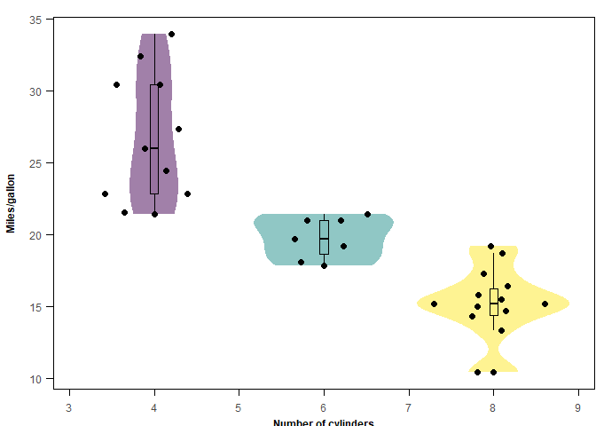

<!-- README.md is generated from README.Rmd. Please edit that file -->
<!--  -->

## toolPhD: Accomplish your academic publication with ease and aesthetic.

<!-- Version : [0.1.0](https://illustratien.github.io/toolPhD/articles/toolPhD.html#version-history); -->
<!-- badges: start -->

[](https://www.r-project.org/Licenses/)
[](https://illustratien.github.io/toolPhD/articles/toolPhD.html)
[](https://github.com/Illustratien/toolPhD)
[](https://github.com/Illustratien/toolPhD/commits/master)
[](https://cran.r-project.org/)
[](https://CRAN.R-project.org/package=toolPhD)
<!-- [](https://app.codecov.io/gh/Illustratien/toolPhD?branch=master) -->
<!-- [](https://github.com/Illustratien/google-analytics-beacon) -->

<!-- badges: end -->
<!-- ## Description -->
<!-- Here provide you functions for table formatting, plots and statistical analysis. Make your academic life easier, consistent and reproducible. -->
<!-- Here provide you functions for table formatting, plots and statistical analysis. Make your academic life easier, consistent and reproducible. -->
<!-- Here provide you functions for table formatting, plots and statistical analysis. Make your academic life easier, consistent and reproducible. There are functions in this package. -->
<!-- This RNA -->
<!-- NA -->
<!-- NA -->
<!-- NA -->
<!-- NA -->
<!-- NA -->

## Introduction


The package `toolPhD` is by-product of the journey of author’s PhD.
Hopefully you find these function also useful for you.

Further analysis for original publication using this package can be
found in the link ([click
here](https://github.com/Illustratien/Wang_2023_TAAG)).

## Installation

<!-- The package can be installed from CRAN as follows: -->
<!-- ```{r, eval=FALSE} -->
<!-- install.packages('toolPhD', dependencies=TRUE) -->
<!-- ``` -->

The development version can be installed from github as follows:

``` r
if (!require('devtools')) install.packages('devtools')
devtools::install_github("Illustratien/toolPhD")
# or
if (!require('remotes')) install.packages('remotes')
remotes::install_github("Illustratien/toolPhD")
```

To update the package:

``` r
detach("package:toolPhD", unload = TRUE)
devtools::install_github("Illustratien/toolPhD")
```

## Descriptions

There are many useful functions in this package. For detailed tutorial
with examples and references, please click the side tab `Get started`
for general tutorial and `Refernce` for individual function example.

Here is an example for `violin_plot()`

``` r
library(toolPhD)
library(ggplot2)
violin_plot(mtcars,cyl,mpg,labx="Number of cylinders",laby="Miles/gallon")
```

<!-- --> <!-- ## What's new -->
<!-- To know whats new in this version type: -->

<!-- ```{r, eval=FALSE} -->
<!-- news(package='toolPhD') -->
<!-- ``` -->

## Citing `toolPhD`

To cite the methods in the package please use: Wang T (2023). toolPhD:
Accomplish your academic publication with ease and aesthetic. R package
version 0.1.0.

    @Manual{,
      title = {toolPhD: Pave your academic path with profession and aesthetic.},
      author = {Tien-Cheng Wang},
      year = {2023},
      note = {R package version 0.1.0},
    }

<!-- # ```{r, echo = FALSE} -->
<!-- # detach("package:toolPhD", unload=TRUE) -->
<!-- # suppressPackageStartupMessages(library(toolPhD)) -->
<!-- # cit <- citation("toolPhD") -->
<!-- # yr <- format(Sys.Date(), "%Y") -->
<!-- # cit[1]$year <- yr -->
<!-- # oc <- class(cit) -->
<!-- #  -->
<!-- # cit <- unclass(cit) -->
<!-- # attr(cit[[1]],"textVersion") <- gsub("\\(\\)", -->
<!-- #                                      paste("\\(", yr, "\\)", sep = ""), -->
<!-- #                                      attr(cit[[1]],"textVersion")) -->
<!-- # class(cit) <- oc -->
<!-- # cit -->
<!-- ``` -->
